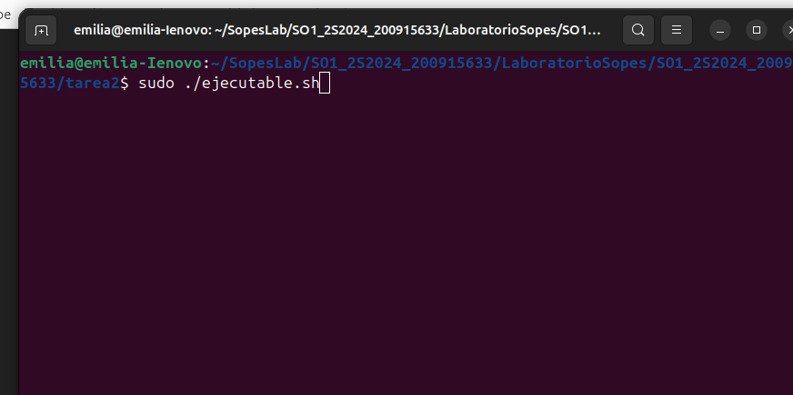

## Universidad de San Carlos
## Facultad de Ingenieria
## Laboratorio de Sistemas Operativos 1

 
  

#### Rosa Emilia Boche Naz
#### 200915633

# Tarea 2

 
 
 

1. Se crea el archivo bash
 
2. Se ejecuta el archivo 

3. Se muestra la información de las imagenes creadas

